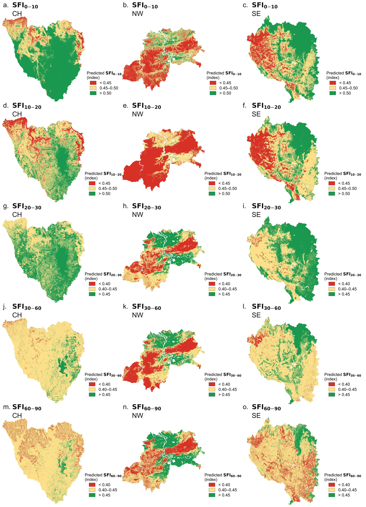

# Tanety-SFI: Mapping Soil Fertility Across Madagascar's Open Ecosystems

Digital soil mapping of a five-depth Soil Fertility Index (SFI) across three bioclimatic regions of Madagascar (Central Highlands, Northwest, Southeast), built on Random Forest tuned through nested cross-validation, cross-checked against a regression-kriging correction on the residuals, and predicted wall-to-wall on GPU.

This repository accompanies the manuscript *"Soil fertility variability under tropical open grassland ecosystems of Madagascar"* (Rafidimanantsoa, Ramifehiarivo et al., submitted to Geoderma Regional). See [Citation](#citation) below.

## What is being predicted

The response variable is a Soil Fertility Index (SFI), modeled separately at five depth layers: 0-10, 10-20, 20-30, 30-60 and 60-90 cm. Modeling each depth as its own response, rather than fitting one model across all depths, lets the covariate relationships and hyperparameters adapt to how each layer behaves: surface fertility is shaped more strongly by recent land use and organic matter turnover, while deeper layers reflect longer-term parent material and drainage effects. Consistent with that, model accuracy in the underlying study declines steadily with depth (R² = 0.64 at 0-10 cm down to R² = 0.12 at 60-90 cm).

### How the SFI itself was built

The SFI is not something this repository computes; it is the target variable, derived beforehand from lab-measured soil properties following the method of Dewi et al. (2024), adapted from Mukashema (2007). Seven physicochemical properties (pH, texture, cation exchange capacity, K, P, C, N) were reduced to six minimum soil fertility indicators (MSFI) after removing one variable from each strongly correlated pair ($|r| > 0.5$), then weighted through a Principal Component Analysis retaining components with eigenvalue $> 1$ (Kaiser criterion). For each observation $i$, the index is

$$
\text{SFI}_i = \sum_{j=1}^{N} W_j \cdot S_{ij} \cdot p, \qquad p = \frac{1}{n}
$$

where $N = 6$ is the number of retained MSFI indicators (pH, CEC, clay content, K, P and C), $S_{ij}$ is the standardized score of indicator $j$ for observation $i$, $n = 5$ is the number of soil fertility classes, and $W_j$ is the weight of indicator $j$, obtained from the PCA loadings as

$$
W_j = \left| x_{jk} \right| \cdot W_k
$$

with $x_{jk}$ the loading of indicator $j$ on retained component $k$ and $W_k$ that component's share of explained variance. This gives a continuous index between 0 and 1, with higher values indicating greater fertility. What this repository does is map that already-computed point-level index across space and depth using the covariate stack described below.

## Covariate stack

Every raster covariate is exported at 30 m resolution and cropped to a common analysis boundary before modeling. The stack spans four broad groups:

**Terrain**
Elevation (ALOS World 3D-30m), slope derived from that same elevation surface, and the Topographic Wetness Index computed from the same digital surface model.

**Vegetation and land cover**
Canopy height (GEDI/Sentinel-2 derived), tree cover fraction (Hansen Global Forest Change), land use/land cover classification (ESA WorldCover), and spectral vegetation indices (NDVI, NDWI, NIRI) derived from Sentinel-2 surface reflectance.

**Climate**
Mean annual temperature and mean annual precipitation, from WorldClim v2.1, standing in for the long-term climatic setting of each pixel.

**Soil and productivity context**
A categorical soil type layer (national Madagascar soil map) and Net Primary Productivity (MODIS MOD17A3HGF) as a proxy for standing biomass production.

Categorical covariates (land cover class, soil type) are kept as integer class codes throughout the pipeline and are never resampled with interpolation methods that would blend one class into another.

## Modeling approach

### Random Forest

Random Forest builds an ensemble of $B$ regression trees, each trained on a bootstrap resample of the training data with a random subset of covariates considered at every split. The final prediction is the average across all trees:

$$
\hat{y}_{RF}(x) = \frac{1}{B} \sum_{b=1}^{B} T_b(x)
$$

Each tree $T_b$ is grown by recursively partitioning the covariate space to minimize within-node variance of the response, which is what makes the model well suited to picking up non-linear, threshold-like relationships between terrain or climate variables and soil fertility without any need to specify a functional form in advance. This is the only algorithm used in the pipeline; there is no gradient boosting stage and no model stacking.

### Hyperparameter tuning and nested cross-validation

Random Forest hyperparameters (number of trees, max depth, min samples per split/leaf, and the number of covariates considered at each split) are tuned with Optuna using a Tree-structured Parzen Estimator sampler, minimizing cross-validated RMSE.

To get an honest estimate of how well the models generalize, tuning and evaluation are separated using nested cross-validation: a 5-fold outer loop holds data out entirely for testing, and within each outer training fold a 3-fold inner loop is used to search for hyperparameters. No test observation is ever involved, directly or indirectly, in choosing the model that predicts it. Response NaNs are dropped rather than imputed, since imputing a target manufactures observations that were never measured; covariate NaNs are median-imputed, but the median is always computed on the training fold only and then applied to the held-out fold, to avoid leaking test-set information into the imputation.

### Feature selection: RFECV

Alongside the full 13-covariate model, a Recursive Feature Elimination with Cross-Validation (RFECV) variant is run inside each outer training fold: covariates are ranked by their contribution to a Random Forest and eliminated one at a time (or in small steps) until removing further covariates would hurt inner-fold RMSE. This is done independently in every outer fold, so the pipeline also reports how consistently each covariate gets kept across folds, which is a more informative signal than a single feature ranking computed once on the full dataset.

### Regression kriging correction

Because SFI observations are geolocated, the pipeline also checks whether the Random Forest residuals still carry exploitable spatial structure once the covariates have done their part. For each outer fold, honest out-of-fold RF residuals are computed on the training data, an Ordinary Kriging model is fit to those residuals (with the variogram model, number of lags, and weighting scheme itself tuned by Optuna against inner-fold RMSE), and the kriged residual surface is added back on top of the RF trend prediction at the held-out test locations:

$$
\hat{y}_{RK}(x) = \hat{y}_{RF}(x) + \hat{z}(x)
$$

where $\hat{z}(x)$ is the kriged prediction of the RF residual field. This "RF + kriging" variant is reported side by side with the plain RF model in the cross-validation summary, so it is possible to see, per depth layer, whether the spatial correction earns its keep or whether the covariates already explain the spatial structure on their own.

### Evaluation metrics

Model performance is reported using five metrics, computed on out-of-fold predictions from the outer cross-validation loop:

$$
\text{RMSE} = \sqrt{\frac{1}{n}\sum_{i=1}^{n}(y_i - \hat{y}_i)^2}
\qquad
\text{MAE} = \frac{1}{n}\sum_{i=1}^{n}\left|y_i - \hat{y}_i\right|
$$

$$
R^2 = 1 - \frac{\sum_{i=1}^{n}(y_i - \hat{y}_i)^2}{\sum_{i=1}^{n}(y_i - \bar{y})^2}
\qquad
\text{RPIQ} = \frac{\text{IQR}(y)}{\text{RMSE}}
$$

$$
\text{CCC} = \frac{2\,s_{xy}}{s_x^2 + s_y^2 + (\bar{x}-\bar{y})^2}
$$

RPIQ, the ratio of the interquartile range of the observed values to RMSE, is included because R² alone can be misleading on skewed soil datasets: a higher RPIQ indicates the model's error is small relative to the natural spread of the data, which is a more robust way to compare model quality across depth layers with very different variance. CCC, the concordance correlation coefficient, additionally penalizes systematic bias between observed and predicted values, not just their correlation.

### Interpretability: permutation importance

Covariate importance is assessed with permutation importance rather than SHAP: each covariate is shuffled in turn, the drop in model performance is measured, and the increase in MSE relative to the unpermuted baseline is reported as %IncMSE, the same statistic reported by R's classic `randomForest` package. This is computed on the final model fit to the full dataset, with 20 repeats per covariate to get a stable estimate and its spread.

### GPU acceleration

Final raster prediction is accelerated on GPU through cuML's Forest Inference Library (FIL), which loads a fitted scikit-learn Random Forest once and evaluates it against millions of pixels in batches. Prediction is carried out tile by tile (2048 x 2048 pixel tiles) to keep GPU memory use bounded regardless of raster size, with per-tile progress tracked to disk so an interrupted run can be diagnosed without redoing the whole surface. Model training and hyperparameter search themselves run on CPU (scikit-learn); only the wall-to-wall raster inference step uses the GPU.

## Spatial prediction

Once final models are fit on the full dataset, each is applied across the entire study area to produce a continuous raster surface for each of the five depth layers. The prediction rasters are then cropped to each of the three bioclimatic regions (Central Highlands, Northwest, Southeast) and mapped on a shared, quantile-based three-class color scale (low / moderate / high fertility) so that panels stay visually comparable across regions and depths, since equal-width classes would otherwise leave most pixels crammed into a single color on this kind of skewed distribution.

### Example result



Predicted SFI across the five depth layers (rows a-o, top to bottom) and the three bioclimatic regions CH, NW, SE (columns). Color bins are quantile-based (equal pixel count) within each depth layer, computed jointly across all three regions so panels in the same row share one legend.

## Repository structure

```
├── config.py                        shared paths, covariate names, run settings
├── data_prep/
│   └── extract_covariates.py        extracts the 13-layer covariate stack at SFI points
├── modeling/
│   ├── common.py                    shared metrics, imputation, Optuna RF tuning
│   ├── nested_cv_rf.py               nested CV, outer-fold evaluation
│   ├── final_models_importance.py    final RF fit + %IncMSE permutation importance
│   ├── regression_kriging.py         RF + kriged-residual correction, nested CV (optional)
│   └── rfe_feature_selection.py      RFECV feature selection inside nested CV (optional)
├── prediction/
│   └── gpu_raster_prediction.py      GPU tiled raster inference (cuML FIL)
├── interpretation/
│   ├── scatterplots.py               observed vs predicted density scatter, all depths
│   └── regional_maps.py              SFI prediction maps by bioclimatic region
└── figures/
    └── ISF_by_region_5x3.png
```

## Running

The intended order is: `data_prep/extract_covariates.py` first, then any of the `modeling/` scripts (they're independent of each other and can be run in any order once the covariate table exists), then `prediction/gpu_raster_prediction.py` once `final_models_importance.py` has produced the saved `.pkl` models, then the two `interpretation/` scripts last.

All scripts currently hardcode Kaggle-style paths in `config.py`; edit that file to point at your own storage before running elsewhere.

## Requirements

Everything except the GPU raster prediction step runs on a standard Python geospatial/ML stack: `geopandas`, `rasterio`, `scikit-learn`, `optuna`, `pykrige`, `joblib`. GPU raster inference additionally needs `cupy` and `cuml`, which are not reliably pip-installable and are best set up through conda (`environment-gpu.yml`). See `requirements.txt` for the pip-installable subset and `environment-gpu.yml` for the full GPU environment. Development and GPU inference were carried out on Kaggle notebooks with a single NVIDIA T4 GPU.

## Citation

If this pipeline or its outputs are useful for your own work, please cite the associated manuscript:

> Rafidimanantsoa, S., Ramifehiarivo, N., Ratovoarimanana, L., Andriamananjara, A., Bouillon, S., Devenish, A., Randrianantenaina, A.S., Razakamanarivo, H. *Soil fertility variability under tropical open grassland ecosystems of Madagascar.* Geoderma Regional (submitted).

See `CITATION.cff` for a machine-readable citation record.

## Acknowledgments

Field data underlying the soil fertility index were collected in collaboration with local research partners across the Ankarafantsika National Park (NW), Ambohitantely-Ankafobe Special Reserve (CH), and the Ivohiboro protected area (SE). 307 plots were sampled across four land-cover classes (forest, shrubland, grassland, reforestation) in 2024.
